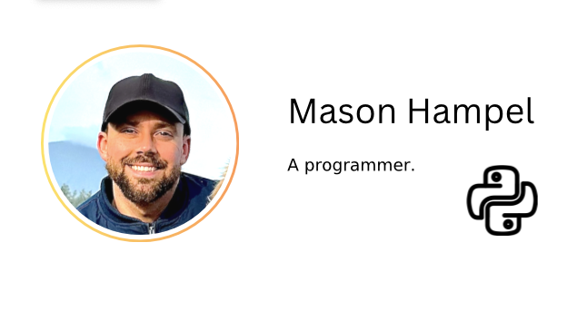

// MasonWebsite
// Mason's Website with links to resume and portfolio and other projects.

<!DOCTYPE html>
<html lang="en">
<head>
    <meta charset="UTF-8">
    <meta name="viewport" content="width=device-width, initial-scale=1.0">
    <title>Mason Resume</title>
    <link href="https://cdn.jsdelivr.net/npm/bootstrap@5.3.3/dist/css/bootstrap.min.css" rel="stylesheet" integrity="sha384-QWTKZyjpPEjISv5WaRU9OFeRpok6YctnYmDr5pNlyT2bRjXh0JMhjY6hW+ALEwIH" crossorigin="anonymous">
    <link href="./css/styles.css" rel="stylesheet">

</head>

    <body>

        

            
            <h1 class="display-32 introFont"> Hello. I'm Mason. </h1>
            
            

                
 I am creative developer living on Vancouver Island. I am a builder, web developer, and data nerd with a degree in mechanical engineering from UBC. I like to build and develop a wide variety of projects.  

                    

                    <button type="button" class="btn btn-info btn-lg px-4 gap-3" style="font-weight: bold;"><a href="./public/resumeMason.html">Resume</a></button>
                            

                                

                                    <button type="button" class="btn btn-outline-dark btn-lg px-4"><a href="./public/webDevProjects.html">Websites</a> </button>
                                    <button type="button" class="btn btn-outline-dark btn-lg px-4">Python </button>
                                    <button type="button" class="btn btn-outline-dark btn-lg px-4">Engineering</button>
                                    <button type="button" class="btn btn-outline-dark btn-lg px-4">Construction</button>
                                    <button type="button" class="btn btn-outline-dark btn-lg px-4">Photography</button>
                                

                            

                    

            

      

      

        <a href="./public/aboutme.html">About Me</a>
        <a href="./public/contact.html">Contact Me</a>
      

        
        <!-- Footer -->
            <footer>
                

                    
© Mason Hampel - All rights reserved

                

            </footer>
        

    </body>

</html>
